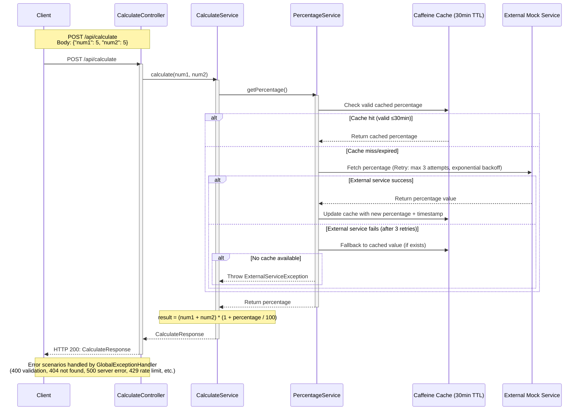

# Tenpo Challenge API

Spring Boot REST API with dynamic percentage calculation, caching, retry logic, async history logging, and rate limiting.

## Architecture

### Sequence Diagram: Calculate Endpoint



---

### Component Architecture

| Component | Package | Description |
|-----------|---------|-------------|
| ChallengeApplication | com.tenpo.challenge | Main Spring Boot entry point, enables caching/retry via `@EnableCaching` + `@EnableRetry` |
| CalculateController | controller | REST endpoint for `POST /api/calculate`, request validation |
| CalculateService | service | Business logic for calculation: `(num1 + num2) * (1 + percentage / 100)` |
| PercentageService | service | External mock service integration, retry logic, cache fallback |
| CacheConfig | config | Caffeine cache configuration with 30-minute TTL |
| OpenApiConfig | config | OpenAPI/Swagger documentation setup, API metadata |
| GlobalExceptionHandler | controller | `@RestControllerAdvice` for HTTP error handling (RFC 7807 ProblemDetail) |
| HistoryLoggingFilter | config | Async filter that logs API calls to PostgreSQL |
| RateLimitFilter | config.ratelimit | Rate limiting filter (3 RPM per IP) using Bucket4j |
| CallHistoryService | service | Async logging of API call history |
| CallHistoryRepository | repository | Spring Data JPA repository for call history |
| ExternalServiceException | service.exceptions | Custom exception for external service failures |

---

### Data Flow Summary

| Step | Component | Input | Output |
|------|-----------|-------|--------|
| 1 | Client | POST /api/calculate | `CalculateRequest` (num1, num2) |
| 2 | CalculateController | `CalculateRequest` | Validates input, calls `CalculateService` |
| 3 | CalculateService | num1, num2 | Calls `PercentageService.getPercentage()` |
| 4 | PercentageService | - | Checks cache → fetches external mock (with retry) → falls back to cache |
| 5 | Caffeine Cache | - | Returns cached percentage (if valid ≤30min) |
| 6 | CalculateService | num1, num2, percentage | Computes result, returns `CalculateResponse` |
| 7 | Client | HTTP 200 | `CalculateResponse` (num1, num2, percentage, result) |

---

## API Endpoints

### POST /api/calculate

Calculates result using formula: `(num1 + num2) * (1 + percentage / 100)`

**Request:**
```json
{
  "num1": 5.0,
  "num2": 5.0
}
```

**Response (200 OK):**
```json
{
  "num1": 5.0,
  "num2": 5.0,
  "percentage": 10.0,
  "result": 11.0
}
```

**Error Responses:**

| Status | Title | Description |
|--------|-------|-------------|
| 400 | Validation Failed | Invalid request body (null values, unknown properties) |
| 400 | Bad Request | Missing or empty request body |
| 429 | Too Many Requests | Rate limit exceeded (3 requests per minute) |
| 500 | Internal Server Error | External service failed, no cache available |

**Error Format (RFC 7807):**
```json
{
  "type": "about:blank",
  "title": "Too Many Requests",
  "status": 429,
  "detail": "Too many requests. Please try again later."
}
```

---

### GET /api/history

Retrieves paginated call history.

**Query Parameters:**
- `page` (default: 0) - Page number (min: 0)
- `size` (default: 10) - Page size (min: 1, max: 100)

**Response (200 OK):**
```json
{
  "content": [
    {
      "id": 1,
      "timestamp": "2026-04-28T20:45:36Z",
      "endpoint": "/api/calculate",
      "parameters": "{\"num1\": 5, \"num2\": 5}",
      "response": "{\"num1\":5.0,\"num2\":5.0,\"percentage\":70.0,\"result\":17.0}",
      "error": null
    }
  ],
  "page": 0,
  "size": 10,
  "totalElements": 25,
  "totalPages": 3,
  "first": true,
  "last": false
}
```

**Error Responses:**

| Status | Title | Description |
|--------|-------|-------------|
| 400 | Constraint Violation | Invalid pagination parameters (negative page, size > 100) |

---

## Prerequisites

- Java 21
- Maven 3.9+
- Docker & Docker Compose
- PostgreSQL (or use Docker)

---

## Local Development

### Running with Maven

```bash
# Clone the repository
git clone <repo-url>
cd challenge

# Run with default profile (rate-limit enabled)
./mvnw spring-boot:run

# Run with specific profile
SPRING_PROFILES_ACTIVE=dev ./mvnw spring-boot:run
```

Application starts at `http://localhost:8080`

### Running with Docker

```bash
# Copy environment example
cp .env.example .env
# Edit .env with your values

# Start services
docker-compose up -d

# View logs
docker-compose logs -f app

# Stop services
docker-compose down
```

---

## Database

- **Production/Dev:** PostgreSQL 15 (Docker container on port 5435)
- **Tests:** H2 in-memory database
- **Schema:** Auto-generated by Hibernate (`ddl-auto: update`)

**Environment Variables:**
```bash
SPRING_DATASOURCE_URL=jdbc:postgresql://localhost:5435/tenpo_db_challenge
SPRING_DATASOURCE_USERNAME=tenpo_db_user
SPRING_DATASOURCE_PASSWORD=tenpo_db_pass
```

Use `.env.example` as template for Docker Compose.

---

## Testing

```bash
# Run all tests
./mvnw test

# Run specific test class
./mvnw test -Dtest=CalculateControllerIntegrationTest

# Run with coverage
./mvnw test jacoco:report
```

**Test Results:**
- 25 tests total
- Unit tests: `CalculateServiceTest`, `PercentageServiceTest`
- Integration tests: `CalculateControllerIntegrationTest`, `RateLimitIntegrationTest`, `HistoryControllerTest`
- All tests pass ✓

---

## OpenAPI Documentation

- **Swagger UI:** `http://localhost:8080/swagger-ui/index.html`
- **OpenAPI Spec:** `http://localhost:8080/v3/api-docs`

**Note:** Swagger is disabled in production profile (`application-prod.yml`)

---

## Rate Limiting

- **Limit:** 3 requests per minute per client IP
- **Response:** HTTP 429 with RFC 7807 ProblemDetail
- **Excluded paths:** `/swagger-ui/`, `/v3/api-docs/`, `/`, `/error`, `/api/history`

**Testing rate limit:**
```bash
# Send 4 requests quickly - 4th should return 429
1..4 | ForEach-Object { 
    Invoke-RestMethod -Uri "http://localhost:8080/api/calculate" `
    -Method POST -ContentType "application/json" -Body '{"num1": 5, "num2": 5}'
}
```

---

## Async History Logging

- All API calls are logged asynchronously to `call_history` table
- Non-blocking - doesn't affect API response time
- Failed logging doesn't impact the request
- History endpoint (`/api/history`) is excluded from logging to prevent recursion

**Disabled in tests:** `@Profile("!test")` on `HistoryLoggingFilter`

---

## Technical Decisions

See [Technical Decisions](README_AGENTIC.md#technical-decisions) section below.

---

## Deployment

### Building Docker Image

```bash
# Build jar
./mvnw package -DskipTests

# Build Docker image
docker-compose build

# Tag for Docker Hub
docker tag challenge-app:latest <your-dockerhub-username>/tenpo-challenge:latest

# Push to Docker Hub
docker push <your-dockerhub-username>/tenpo-challenge:latest
```

### Running in Production

```bash
SPRING_PROFILES_ACTIVE=prod \
  SPRING_DATASOURCE_URL=jdbc:postgresql://postgres:5432/tenpo_db_challenge \
  SPRING_DATASOURCE_USERNAME=tenpo_db_user \
  SPRING_DATASOURCE_PASSWORD=tenpo_db_pass \
  docker-compose up -d
```

---

## Monitoring

- **Health Check:** `http://localhost:8080/actuator/health`
- **Metrics:** `http://localhost:8080/actuator/metrics`

---

## Technical Decisions

### 1. Spring Boot 3.5 + Java 21
- Modern LTS Java version with performance improvements
- Spring Boot 3.5 provides built-in RFC 7807 `ProblemDetail` support

### 2. Caffeine Cache
- **30-minute TTL cache requirement, single-node deployment**
- **Trade-off:** Not distributed, but simpler and sufficient for the requirements
- **Future:** Can migrate to Redis if multi-replica deployment needed

### 3. Bucket4j with Caffeine Backend
- **In-memory rate limiting per client IP, no external dependencies**
- **Limitation:** Not shared across replicas (use Redis backend for distributed setup)

### 4. PostgreSQL for History
- **Per requirement**
- **Docker:** Runs in container, persisted via volume

### 5. H2 for Tests
- **Fast, in-memory, no external dependencies needed**
- **Scope:** Test-scoped dependency, doesn't affect production

### 6. Async History Logging with @Async
- *Non-blocking, doesn't impact API response time**
- **Implementation:** `HistoryLoggingFilter` + `@Async` in `CallHistoryService`
- **Profile-based:** Disabled in test profile to avoid async context issues

### 7. RFC 7807 ProblemDetail
- **Standard HTTP error format, built-in Spring Boot 3 support**
- **Implementation:** Using `org.springframework.http.ProblemDetail`
- **Benefit:** Machine-readable error responses, no custom error codes needed

### 8. Profile-based Configuration
- **`rate-limit`:** Activates `RateLimitFilter`
- **`!test`:** Disables `HistoryLoggingFilter` in tests
- **`prod`:** Disables Swagger UI, uses production DB config

### 9. Environment Variables for Credentials
- **Security best practice, no hardcoded secrets**
- **Implementation:** `${ENV_VAR:default}` syntax in `application.yml`
- **Docker:** `.env.example` provided for easy setup

---

## Project Structure

```
challenge/
├── src/main/java/com/tenpo/challenge/
│   ├── controller/
│   │   ├── CalculateController.java    # POST /api/calculate
│   │   ├── HistoryController.java      # GET /api/history
│   │   └── GlobalExceptionHandler.java # RFC 7807 error handling
│   ├── service/
│   │   ├── CalculateService.java      # Business logic
│   │   ├── PercentageService.java     # External mock + retry + cache
│   │   ├── CallHistoryService.java   # Async history logging
│   │   └── exceptions/
│   │       └── ExternalServiceException.java
│   ├── config/
│   │   ├── CacheConfig.java          # Caffeine cache (30min TTL)
│   │   ├── AsyncConfig.java          # Thread pool for @Async
│   │   ├── OpenApiConfig.java       # Swagger/OpenAPI config
│   │   ├── HistoryLoggingFilter.java # Async call logging filter
│   │   └── ratelimit/
│   │       └── RateLimitFilter.java  # 3 RPM rate limiting
│   ├── repository/
│   │   ├── CallHistoryRepository.java
│   │   └── entity/
│   │       └── CallHistory.java
│   └── dto/
│       ├── CalculateRequest.java
│       ├── CalculateResponse.java
│       ├── CallHistoryResponse.java
│       └── PageResponse.java
├── src/test/java/... (unit & integration tests)
├── docker-compose.yml
├── Dockerfile (multi-stage build)
├── .env.example
├── .gitignore
└── pom.xml
```

---
