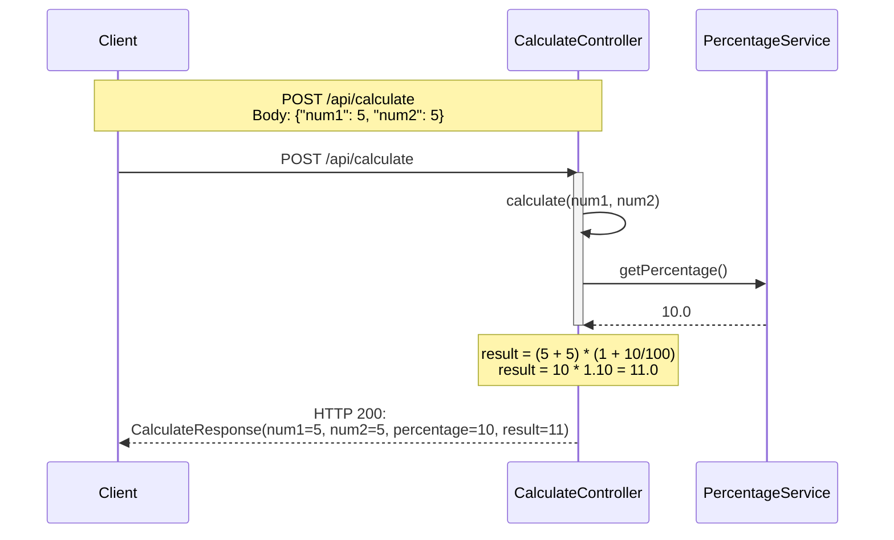

# Sequence diagram for calculate api request

---

## Data Flow Summary

| Step | Component | Input | Output |
|------|-----------|-------|--------|
| 1 | Client | POST /api/calculate | CalculateRequest |
| 2 | CalculateController | CalculateRequest | Calls getPercentage() |
| 3 | PercentageService | - | 10.0 (mock) |
| 4 | CalculateController | num1, num2, percentage | CalculateResponse |
| 5 | Client | HTTP 200 | CalculateResponse |